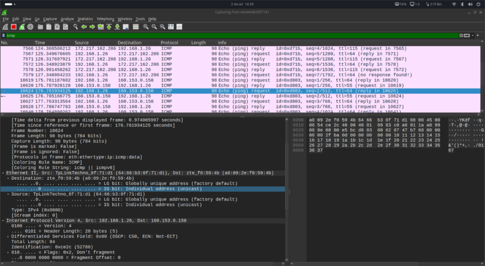
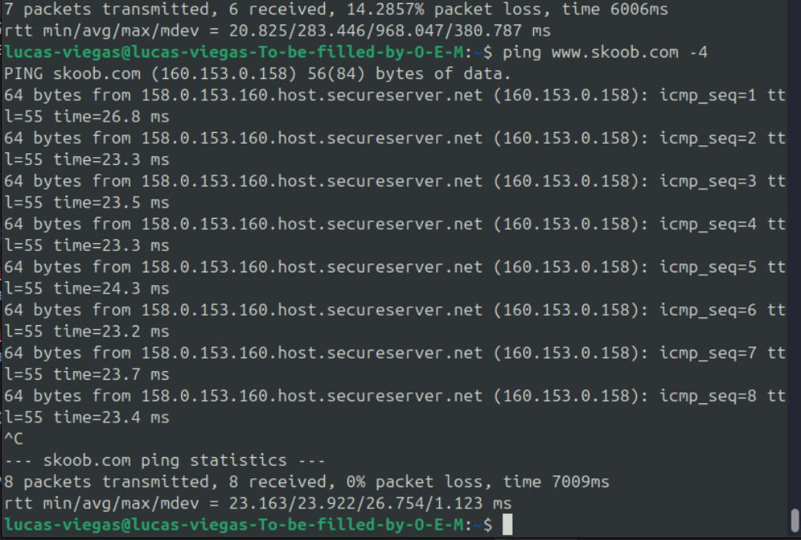

# Parte 2: Capturar e Analisar Dados ICMP na Rede Local

{width="6.260416666666667in"
height="3.4375in"}

{width="6.260416666666667in"
height="4.21875in"}

=

# Parte 3: Capturar e Analisar Dados ICMP Remotos

Nesta parte, vamos comparar o tráfego local com o tráfego destinado a
redes externas (remotas). Etapa 1: Iniciar uma Nova Captura

1.  No Wireshark, clique novamente em **Interface List**, selecione a
    mesma interface e clique em **Start**.

2.  O programa perguntará se você deseja salvar a captura anterior.
    Clique em **Continue without Saving**.

3.  Com a captura ativa, volte ao Prompt de Comando e execute o comando
    ping para os seguintes sites:

> {width="9.375e-2in"
> height="0.5520833333333334in"}ping
> [www.yahoo.com](https://www.yahoo.com) ping
> [www.cisco.com](https://www.cisco.com) ping
> [www.google.com](https://www.google.com)

4.  Observe que o DNS converte as URLs para endereços IP. Anote os IPs
    correspondentes.

5.  Pare a captura de dados no Wireshark.

## Etapa 2: Examinar os Dados da Captura Remota

1.  Para cada um dos pings que você realizou, selecione o primeiro
    pacote de **\"Echo (ping) request\"**.

2.  Na seção do meio, expanda a camada **Ethernet II**.

3.  Preencha a tabela abaixo com os endereços IP e MAC de **destino** de
    cada um dos três pings:

**Local** **Endereço IP de Destino** **Endereço MAC de Destino**

+-------------+---------------------------+----------------------------+
| > Yahoo     | (200.152.173.205)         | (a0:09:2e:f0:59:4b)        |
+-------------+---------------------------+----------------------------+
| > Cisco     | (95.101.80.102)           | (a0:09:2e:f0:59:4b)        |
+-------------+---------------------------+----------------------------+

Google (172.217.172.132) (a0:09:2e:f0:59:4b)

{width="6.260416666666667in"
height="2.0833333333333332e-2in"}

# Questões dissertativas

Responda às seguintes perguntas com base em sua análise:

1.  Na Parte 2, como o seu computador descobriu o endereço MAC do
    computador do seu colega? (Dica: pesquise sobre o protocolo ARP).

2.  Na Parte 3, os endereços MAC de destino que você anotou pertencem
    aos servidores da Cisco, Google e Yahoo? Se não, a qual dispositivo
    eles pertencem? Qual é a importância dessa informação?

3.  Comparando os resultados da Parte 2 e da Parte 3, explique por que o
    Wireshark exibe o endereço MAC real do host de destino para pings
    locais, mas não para pings remotos.

> Reposta geral: Eu considero que errei algo pois o endereço mac no
> wireshark ficou igual
