**Materia**: Fundamentos de redes -- ENE0274

**Professor:** Laerte Peotta de Melo, Dr.

**Aluno**: lucas de souza viegas


## Parte 1 -- Conceitos e Reflexão

#### 1)

1.  Hosts: São dispositivos ligados nas extremidades da rede, onde a
    comunicação começa ou termina, nessa comunicação o host não
    encaminha nenhum pacote.

-   Ex: Computador pessoal(desktops, estações de trabalho)

2.  Repetidor: Se trata de um equipamento que amplifica o sinal para
    aumentar o alcance da rede, o repetidor está localizado na camada
    física (camada 1 do modelo OSI), uma das funções e regenerar o sinal
    que se degradam ao longo da transmissão.

-   Ex: Repetidor wi-fi em casa que leva o sinal até um cômodo dentro de
    casa.

3.  Hub: se trata do dispositivo que conecta computadores a uma rede
    local, a função dele é repassar os dados para todas as portas.

-   Obs: foi substituído pelo switch.

4.  Switch: Se trata de um dispositivo que conecta várias LAns de uma
    rede local, a função principal do switch nessa conexão é receber os
    dados e enviar eles apenas para o destino, o switch atua na camada 2
    do modelo OSI (enlace), além da identificação ser feita por meio do
    endereço MAC.

-   Ex: Um escritório com 10 computadores conectados ao switch, então
    quando o primeiro PC envia o arquivo para o segundo, a informação
    será captada so por ele e não pelos outros.

5.  Roteador: Se trata do dispositivo que interliga redes diferentes,
    decidindo o melhor caminho para os pacotes, ele atua na camada 3
    (rede) do modelo OSI.

-   Ex: Roteador wi-fi de casa que conecta a LAN com a WAN.

6.  Gateway: dispositivo que liga uma rede pessoal (LAN) a internet ou
    outra rede, servidor de "porta de saide" para os pacotes que vão
    para fora da rede

-   Ex: Roteador wi-fi de casa geralmente é um gateway.

## **Captura real**

> {width="6.260416666666667in"
> height="0.17708333333333334in"}

1.  Host:ucas-viegas-To-be-filled-by-O-E-M

2.  Roteador/Gateway: servidor DNS 1.1.1.1.

3.  **Servidor DNS (host remoto)**: respondeu com o registro AAAA.

### 2)

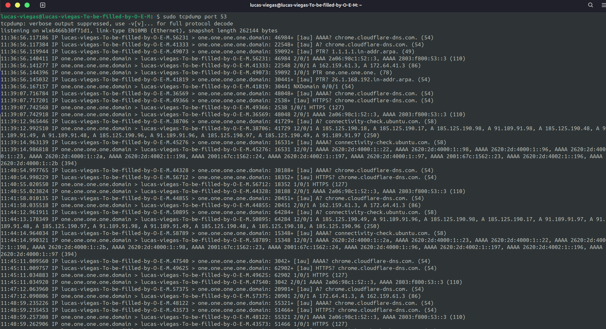{width="6.260416666666667in"
height="3.40625in"}

1.  Os pacotes na ethrnet:listening on wlx6466b30f71d1, link-type EN10MB
    (Ethernet), snapshot length 262144 bytes

2.  IP: 11:36:56.117186 IP lucas-viegas-To-be-filled-by-O-E-M.56231 \>
    one.one.one.one.domain:

#### 3)

-   **Switch** decide baseado em **endereços MAC (camada 2)**.\
    Exemplo: quando o PC solicita a requisição DNS, o switch interno
    entrega o quadro para a porta do roteador (baseado no MAC destino).

-   **Roteador** decide baseado em **endereços IP (camada 3)**.\
    Exemplo: o pacote IP lucas-viegas-To-be-filled-by-O-E-M.56231 \>
    one.one.one.one.domain mostra o roteador encaminhando para o IP do
    servidor DNS **1.1.1.1**.

## Parte 2 -- Experimento com Tcpdump

4\)

1.  Hosts e aplicações

> 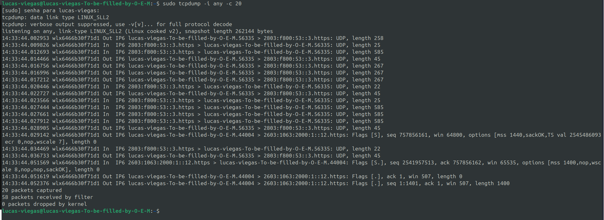{width="6.260416666666667in"
> height="2.2916666666666665in"}

-   14:33:44.016756 wlx6466b30f71d1 Out IP6
    lucas-viegas-To-be-filled-by-O-E-M.56335 \> 2803:f800:53::3.https:
    UDP, length 267

-   14:33:44.016996 wlx6466b30f71d1 Out IP6
    lucas-viegas-To-be-filled-by-O-E-M.56335 \> 2803:f800:53::3.https:
    UDP, length 267

-   14:33:44.017212 wlx6466b30f71d1 Out IP6
    lucas-viegas-To-be-filled-by-O-E-M.56335 \> 2803:f800:53::3.https:
    UDP, length 267

1.  Host local:lucas-viegas-To-be-filled-by-O-E-M

2.  É o sistema final de origem, que inicia conexões para navegar na
    web.

3.  Papel: gera requisições HTTPS/DNS e recebe as respostas.

4.  O papel dels como sistema de destino é o processamento da requisição
    e o envio de dados

```{=html}
<!-- -->
```
1.  Sistemas finais(end systems) em rede são dispositivos com o papel de
    gerae e consumir dados, ele estão nas extremidades da comunicação.

5)Arp e switches

1.  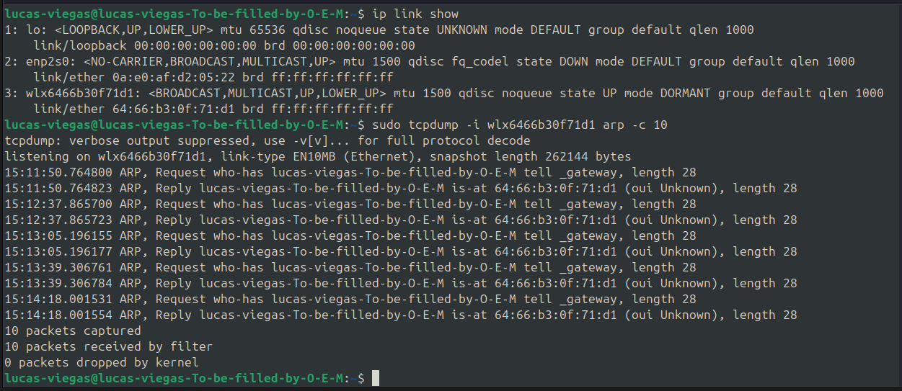{width="6.010416666666667in"
    height="2.6041666666666665in"}

-   Host:15:11:50.764800 ARP, Request who-has \_gateway tell
    lucas-viegas-To-be-filled-by-O-E-M, length 28

-   Reply (quem responde):15:11:50.764823 ARP, Reply \_gateway is-at
    64:66:b3:0f:71:d1, length 28

1.  Mac:64:66:b3:0f:71:d1.

2.  Como o switch não entende o ARP diretamente sendo esse o papel da
    camada 3, ele faz o papel de observar os quadros Ethernet que
    carregam os ARPs.

3.  O switch aprende o MAC de origem, assim ao receber os pacotes, ele
    registra na sua tabela CAM( MAC Address Table) em que porta está
    cada dispositico.

6)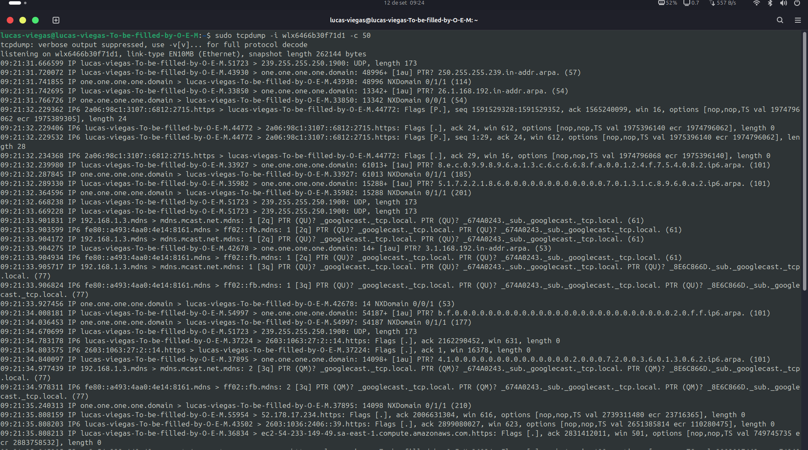{width="6.260416666666667in"
height="3.4895833333333335in"}

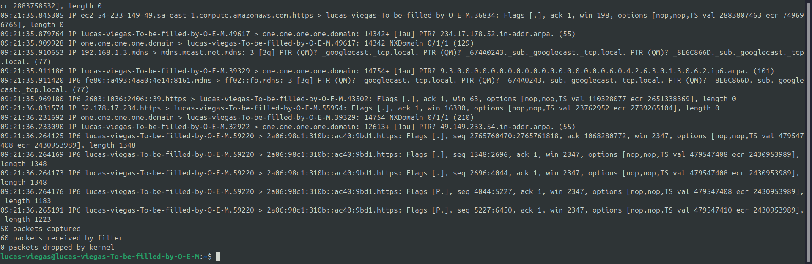{width="6.260416666666667in"
height="2.0416666666666665in"}

1.  Na minha captura com tcpdump, consegui observar que pacotes DNS,
    multicast e conexões HTTPS iniciadas pelo meu computador. Isso
    confirma que o switch só me entrega pacotes destinados a mim ou de
    broadcast/multicast. Se estivéssemos em um hub, eu também veria
    pacotes unicast entre outros dispositivos da rede, pois o hub
    replica todo o tráfego para todas as portas, sem distinguir o
    destino.

7)Gateway padrão

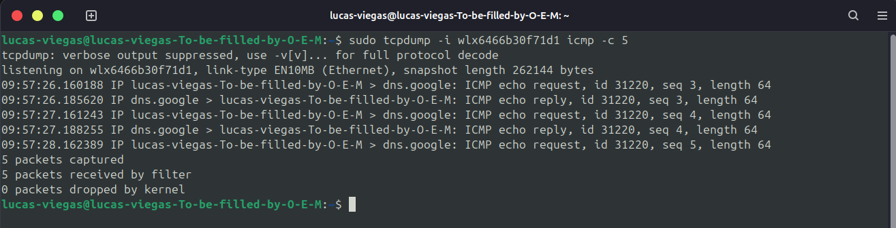{width="6.260416666666667in"
height="1.6041666666666667in"}

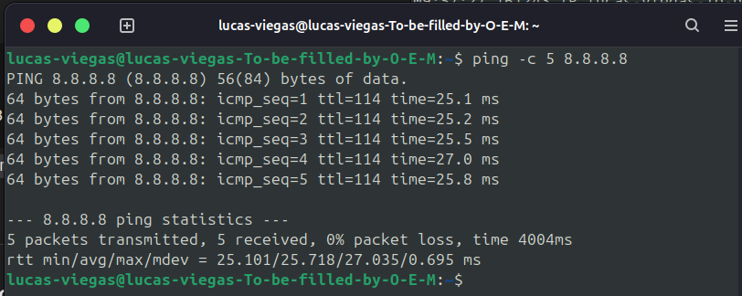{width="6.260416666666667in"
height="2.5in"}

1.  Durante o experimento observei que ao rodar o ping 8.8.8.8, os
    pacotes ICMP requisitados (echo request)saindo do meu compuador e os
    pacotes ICMP de resposta(echo reply) retornando. O entendimento é
    que os pacotes passaram pelo gateway padrão da rede.

8)Roteadores e TTL

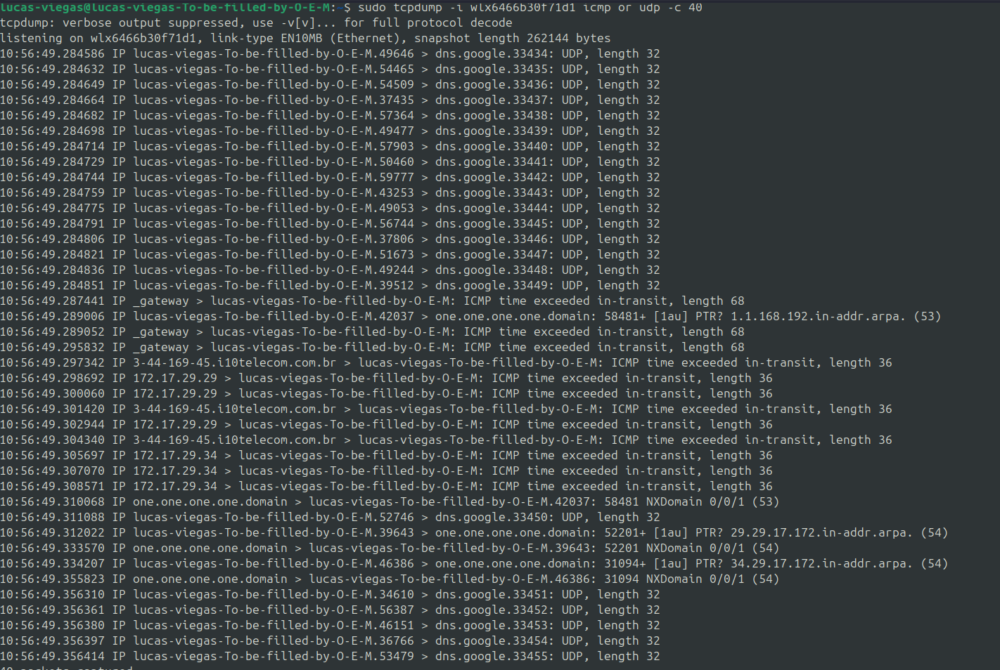{width="6.260416666666667in"
height="4.197916666666667in"}

{width="6.260416666666667in"
height="0.3854166666666667in"}
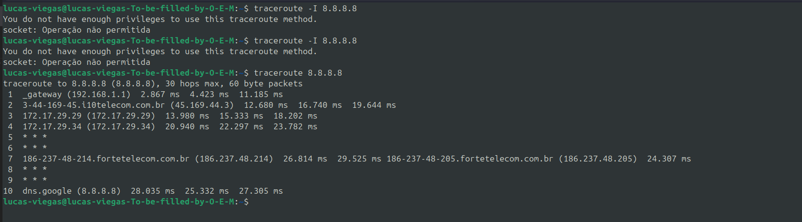{width="6.260416666666667in"
height="1.75in"}

Na captura foi possível identificar pelo menos **três roteadores
diferentes** respondendo:

1.  \_gateway (192.168.1.1) -- o roteador local da rede doméstica.

2.  172.17.29.29 -- primeiro roteador do provedor de internet.

3.  172.17.29.34 -- outro roteador no backbone do provedor.

4.  Isso demonstra que o TTL é decrementado em cada salto da rota, nos
    permitindo identificar os roteadores intermediários até o destino
    final.

## Parte 3 -- Meios de transmissão e observação

9\) meios guiados e não guiados

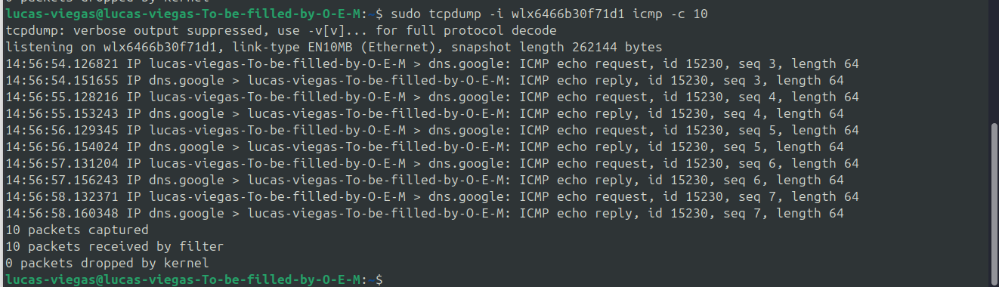{width="6.260416666666667in"
height="1.8020833333333333in"}

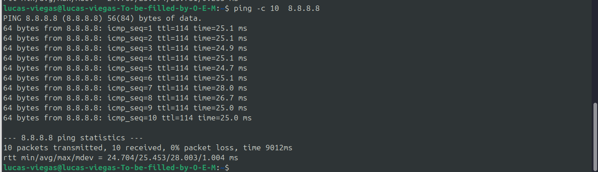{width="6.260416666666667in"
height="1.8020833333333333in"}

1)O comando sudo tcpdump -i wlx6466b30f71d1 icmp -c 10 foi executado
para capturar 10 pacotes ICMP (Internet Control Message Protocol) na
interface de rede wlx6466b30f71d1.

-   **-i wlx6466b30f71d1**: Especifica a interface de rede a ser usada
    para a captura. Neste caso, é a wlx6466b30f71d1, que é uma conexão
    Ethernet.

-   **icmp**: Filtra para capturar apenas pacotes do tipo ICMP.

-   **-c 10**: Limita a captura a 10 pacotes.

A saída mostra uma série de eventos de **ICMP echo request**
(solicitação de eco) e ICMP echo reply. Cada linha representa um pacote,
na solicitação o host enviou um pedido de eco para o servidor que
respondeu confirmando o recebimento do pacote. O comando mostra que 10
pacotes foram capturados e 10 foram recebidos pelo filtro, com 0 pacotes
perdidos pelo kernel. Isso indica que a conexão de rede está funcionando
perfeitamente sem perdas ou interrupções, o que é esperado em uma
conexão via cabo Ethernet, que é um meio guiado.

10\)

1.  Site nacional

> 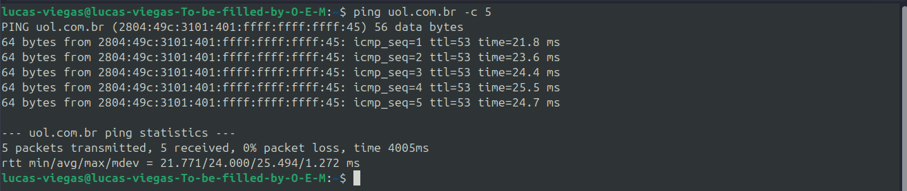{width="6.260416666666667in"
> height="1.3229166666666667in"}
>
> 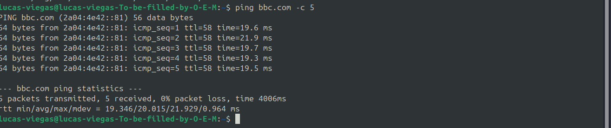{width="6.260416666666667in"
> height="1.3229166666666667in"}

1.  A latência do site do UOL tem uma variação de 21,7 a 25,5 ms.

2.  A latência do site da BBC tem uma variação de 19,3 a 21,9 ms.

3.  Nos testes de ping, o site nacional (UOL) apresentou **\~24 ms** de
    latência e o internacional (BBC) **\~19 ms**, valores típicos de
    conexões em **fibra óptica** com CDNs e rotas otimizadas.\
    Se fosse via **satélite geoestacionário**, a latência seria muito
    maior pois o sinal precisa percorrer cerca de 72.000 km até o
    satélite e voltar.

4.  Alem disso a fibra otica garante baixa latencia que é muito bom para
    chamada de voz, jogos entre outros, enquanto por satelite tem uma
    alta latencia que é recomnada para locais remotos.
