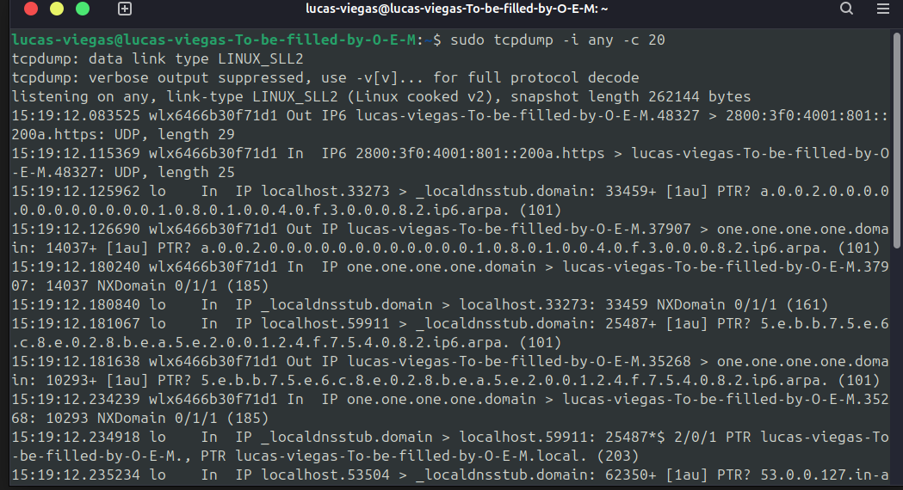
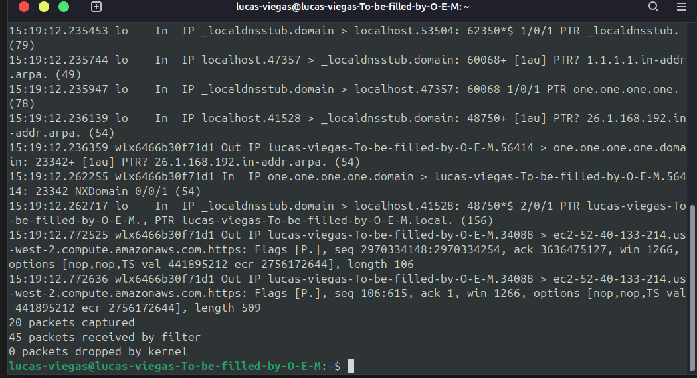
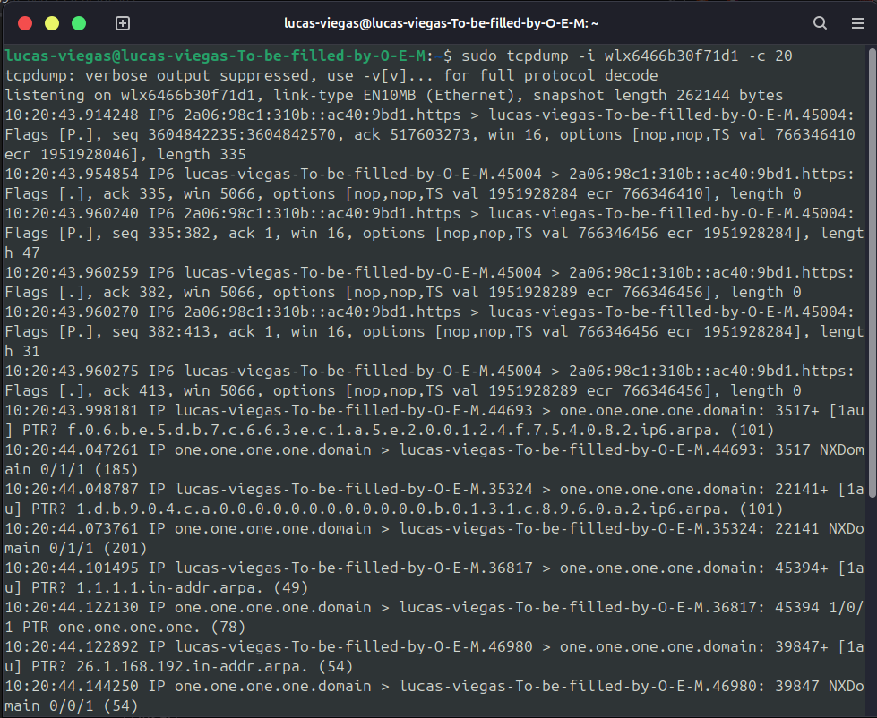
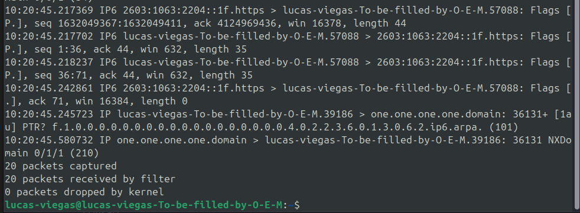
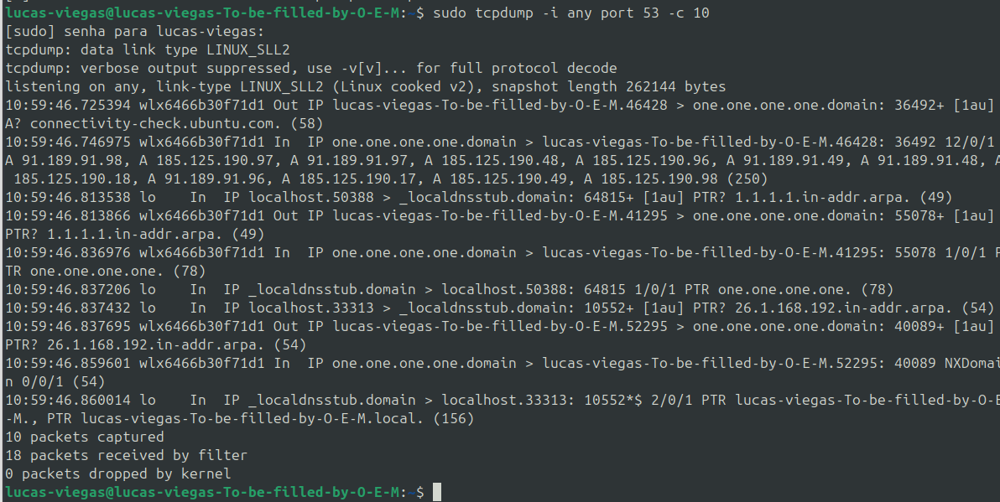
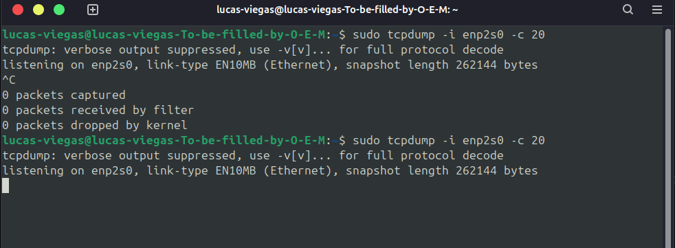

**Materia**: Fundamentos de redes -- ENE0274

**Professor:** Laerte Peotta de Melo, Dr.

**Aluno**: lucas de souza viegas

## Parte 1 -- Conceitos teoricos

1\)

1.  **ADSL (Asymmetric Digital Subscriber Line):** Tem a largura de
    banda de baixa a média, sendo assimétrica, o que significa que o
    download é maior que o upload. A latência é moderada podendo sofrer
    degradação com a distância do usuário a central, além disso, o
    compartilhamento é individual no fio de cobre, mas sujeito a
    interferência externa.

2.  **HFC (Hybrid Fiber-Coaxial):** A largura de banda do HFC é de média
    a alta, com o compartilhamento entre o usuário de uma mesma célula
    do cabo coaxial, além disso, a latência dele pode se baixa e
    variando conforme a quantidade de usuários conectados vai
    aumentando. Tem um compartilhamento forte no coaxial ⇾
    congestionamento em horário de pico.

3.  **FTTH (Fiber to the Home):** A largura de banda do FTTH é muita
    alta indo de ate 1 Gbps ou mais, dessa forma a latência dessa
    tecnologia é muito baixa sendo estável. O compartilhamento da fibra
    pode dedicada(P2P) ou compartilhada(GPON), geralmente mantém alta
    estabilidade.

4.  **Wi-Fi (Wireless Fidelity):** A largura de banda é variável, pois
    depende do padrão (802.11n/ac/ax), a latência varia devido a
    interferência de radio e da distância de dispositivos. O
    compartilhamento alcança todos os dispositivos que disputam o mesmo
    canal (CSMA/CA);

5.  É mais provável observar maior variância de tancia(jitter) no Wi-Fi
    seguindo pelo HFC.

2\)

1.  Um exemplo a ser capturado caso estivesse em uma PAN(Personal Area
    Network) seria a conexão bluetooth entre um celular e um fone de
    ouvido. No tcpdump veríamos o trafego encapsulado em bluetooth HCI(
    host Controller Interface) ou pacotes relacionados ao protocolo
    RFCOMM que é similar a portas seriais virtuais. Uma aplicação
    provável é um streaming de áudio(A2DP) ⇾ pacotes pequenos e
    frequentes.

2.  Um exemplo é a tranferencia de arquivos em um servidor interno via
    SMB (porta 445) ou NFS. No tcpdump veriamos os pacotes TCP de
    tamando maximo (MTU cheia), logo em sequencia, transportando blocos
    de dados. A ptovavel aplicação seria o backup ou compartilhamento de
    arquivos em um ambiente corporativo.

3\)

1.  Rede residencial: O trafego é mais voltado para o consumo de
    multimidia e lazer. Um exemplo é quando utilizamos um streaming de
    video como a netflix ou youtube onde os pacotes em UDP( QUIC, porta
    443), compadrões de bufferização( picos de silencio) oju jogos
    online onde os pacotes UDP que são pequenos, frequentes e com baixa
    tolerancia. No tcpdump se observa que os fluxos são curtos e com
    conexões com serviços de CDN.

2.  Rede corporativa: O trafego é mais voltado para produtividade e
    segurança. Um exemplo é o acesso a sistemas ERP/CRM(HTTPs, REST,
    APIs), VPN e serviços internos como o DNS corporativo. No Tcpdump ,
    aparecem como padrões de comunicações estáveis,, com IPs fixos e
    trafego cifrado constante.

3.  Em resumo, o trafego residencial é mais diversificado e bursty
    (picos de consumo), e na corporativa é mais padronizada, monitorada
    e previsível.

## Parte 2 -- Exercícios práticos

4\) Identificando protocolos

{width="6.260416666666667in"
height="3.40625in"}

{width="6.260416666666667in"
height="3.40625in"}

1.  DNS

-   In IP localhost.33273 \> \_localdnsstub.domain Out IP
    lucas-viegas-To-be filled\... \> one.one.one.one.domain

-   Categoria: Resolução de nomes (Aplicação).

-   Rede mais crítica: **Redes locais e acesso à Internet.** Sem DNS,
    não conseguimos traduzir nomes de sites (ex: google.com) para
    endereços IP.

2.  HTTP/HTTPS

-   Out IP6 lucas-viegas-To-be-filled\... \>
    2800:3f0:4001:801::200a.https Out IP lucas-viegas-To-be-filled\...
    \> ec2-52-40-133-214.us-west-2.compute.amazonaws.com.https

-   Categoria: Transferência de dados na Web (Aplicação).

-   Rede mais crítica: **Redes de acesso à Internet.**\
    Essencial para navegação na web, APIs e comunicação entre servidores
    e clientes.

3.  LS (Transport Layer Security)

-   ec2-52-40-133-214.us-west-2.compute.amazonaws.com.https: Flags
    \[P.\], ..

-   (Quando vemos https, ele está encapsulado em **TLS** sobre TCP).

-   Categoria: Segurança/Criptografia (Camada de Sessão/Apresentação).

-   Rede mais crítica: **Redes públicas (Wi-Fi, Internet).**

-   TLS garante confidencialidade e integridade na comunicação, evitando
    espionagem ou ataques man-in-the-middle.

4.  **DNS** → Crítico em **redes locais e de acesso à Internet**, pois
    permite a resolução de nomes para endereços IP.

5.  **HTTP/HTTPS** → Crítico em **redes de acesso à Internet**,
    garantindo a comunicação de sites e serviços web.

6.  **TLS** → Crítico em **redes públicas e abertas**, pois protege a
    comunicação com criptografia.

5)Comparando trafego em redes diferentes

1.  sudo tcpdump -i wlx6466b30f71d1 -c 20

{width="6.010416666666667in"
height="4.9203412073490815in"}

> {width="6.0625in"
> height="2.3645833333333335in"}

1.  Na interface **Wi-Fi (wlx6466b30f71d1)**, o tcpdump capturou 20
    > pacotes em poucos segundos, evidenciando tráfego ativo. Da pra
    > observar os protocolos **IPv6** e **HTTPS (porta 443)**, além de
    > várias consultas DNS ao servidor **1.1.1.1 (Cloudflare)**,
    > incluindo registros reversos (PTR).\
    > Os pacotes apresentaram sequências com Flags \[P.\], ack e seq,
    > caracterizando troca de dados encriptados via TLS/SSL.

2.  Dessa forma a rede Wi-Fi está operando em pilha dupla (IPv4/IPv6) e
    > que o tráfego inclui tanto navegação quanto resolução de nomes.

3.  Na interface Ethernet (enp2s0), não houve captura de pacotes, pois a
    > placa de rede não estava conectada a nenhum cabo no momento do
    > teste. Isso confirma que, ao contrário da Wi-Fi que capturou
    > tráfego de broadcast e consultas DNS, a Ethernet só gera tráfego
    > quando está fisicamente conectada a uma rede.\
    > Se estivesse conectada, esperaria observar menos broadcast que no
    > Wi-Fi, e pacotes diretos entre os dispositivos, já que a Ethernet
    > via switches é menos sujeita a colisões.

6)Detectando consultas DNS

1.  sudo tcpdump -i any port 53 -c 10

{width="6.260416666666667in"
height="3.1458333333333335in"}

2.  **Consulta DNS** (query):10:59:46.725394 wlx6466b30f71d1 Out IP
    lucas-viegas-To-be-filled-by-O-E-M.46428 \> one.one.one.one.domain:
    36492+ \[1au\] A? connectivity-check.ubuntu.com. (58)

-   O host perguntou ao servidor DNS (one.one.one.one = 1.1.1.1 da
    Cloudflare) qual é o IP associado ao domínio
    connectivity-check.ubuntu.com.

3.  **Resposta DNS** (answer): 10:59:46.746975 wlx6466b30f71d1 In IP
    one.one.one.one.domain \> lucas-viegas-To-be-filled-by-O-E-M.46428:
    36492 12/0/1 A 91.189.91.97, A 185.125.190.49, A 91.189.91.48, A
    185.125.190.96, \...

-   O servidor respondeu com vários endereços IP (registros tipo A) que
    correspondem ao domínio solicitado.

4.  **Em LANs corporativas**:

-   Permite que colaboradores acessem serviços internos e externos sem
    precisar decorar endereços IP.

-   É essencial para autenticação, acesso a aplicações em nuvem e
    segurança como firewalls e proxies muitas vezes dependem de DNS.

-   Facilita a gestão de políticas de acesso e auditoria.

5.  **Em redes domésticas Wi-Fi**:

-   Usuários acessam sites e aplicativos pelo nome em vez de IPs, um
    exemplo pode ser o youtube.

-   Essencial para resolução de endereços em dispositivos IoT,
    streaming, jogos e navegação geral.

-   DNS também é usado em verificações de conectividade automática (como
    o connectivity-check.ubuntu.com visto na sua captura).

> Ou seja, sem DNS, tanto em empresas quanto em casa, seria impraticável
> usar a internet de forma intuitiva, já que teríamos que lembrar IPs
> numéricos para cada serviço.

## Parte 3 -- Analise e interpretação

7\)

1.  **Por que são típicos em LANs?**

-   Em **LANs**, os dispositivos precisam descobrir uns aos outros (ARP)
    ou obter configuração de rede (DHCP).

-   O broadcast funciona porque todos os dispositivos de uma mesma rede
    local recebem a mensagem.

2.  **Por que são irrelevantes em WANs?**

-   Em **WANs**, os roteadores não propagam broadcast para fora da rede
    local → esse tráfego fica restrito a cada segmento de LAN.

-   Isso evita sobrecarga na internet global e mantém a escalabilidade.

-   Em **LANs**, broadcast (ARP/DHCP) é essencial para descoberta e
    configuração. Em **WANs**, não aparece porque roteadores bloqueiam
    broadcast.

-   O **ping** permite medir latência média (RTT) e jitter (variação).
    Em **HFC**, jitter tende a ser maior; em **FTTH**, menor e mais
    estável.

8\) ping 8.8.8.8 -c 10

{width="6.260416666666667in"
height="2.3020833333333335in"}

-   **Latência média:** \~ **29.1 ms**

-   **Jitter (variação de atraso):** \~ **1.1 ms**

Isso significa que o tempo de resposta entre os pacotes é **baixo e
bastante estável**, ideal para aplicações em tempo real (chamadas VoIP,
videoconferência, jogos online).

### **omparação HFC vs FTTH**

**HFC (Hybrid Fiber-Coaxial):**

-   Como o cabo coaxial é compartilhado, a latência pode variar bastante
    em horários de pico.

-   Jitter tende a ser **maior** (variações de vários ms a dezenas de
    ms).

-   Pode causar travamentos em chamadas de vídeo/jogos.

**FTTH (Fiber To The Home):**

-   Fibra dedicada até a casa → tráfego mais estável.

-   Latência e jitter **menores** e mais consistentes.

-   Muito mais adequado para serviços sensíveis a atraso.
