**Materia**: Fundamentos de redes -- ENE0274

**Professor:** Laerte Peotta de Melo, Dr.

**Aluno**: lucas de souza viegas

## Parte 1 - Introdução

1.  Resolver um nome e identificar servidor que respondeu:

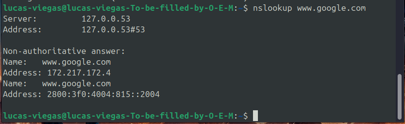{width="6.260416666666667in"
height="1.8854166666666667in"}

-   O **servidor DNS usado** foi o 127.0.0.53, que é um **resolver
    local** (systemd-resolved).

-   Esse resolver trouxe a resposta de DNS com dois endereços validos,
    um IPV4 e o IPV6 para o domínio.

2.  Consultar tipo MX (servidores de
    e-mail):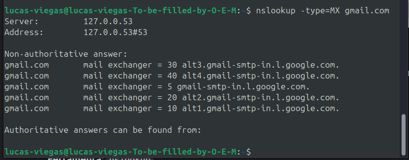{width="6.010416666666667in"
    height="2.3541666666666665in"}

-   Cada linha mostra um **servidor de e-mail** que pode receber
    mensagens para o domínio gmail.com.

-   O número nele quer dizer a prioridade, então se ele for menor a
    prioridade é baixa e se for o maior número a prioridade é alta.

3.  Trocar o servidor DNS (ex.: Cloudflare):

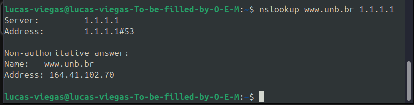{width="6.260416666666667in"
height="1.6041666666666667in"}

-   O domínio [www.unb.br](https://www.unb.br) foi resolvido para o IP
    164.41.102.70.

-   O resultado é não autoritativo porque o Cloudflare não é o servidor
    DNS oficial da UNB, mas sim um resolvedor recursivo que pegou a
    resposta dos servidores autoritativos da UNB

## Parte 2 - Explorando mais campos

Ferramenta 2: dig

1.  Consultar registros A e observar TTL:

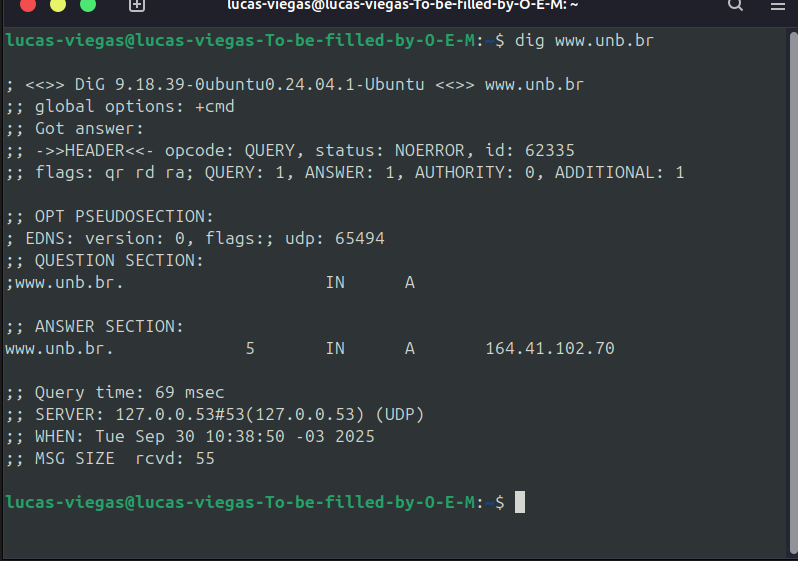{width="6.260416666666667in"
height="4.40625in"}

-   [www.unb.br](https://www.unb.br). 5 IN A 164.41.102.70

-   **5** → TTL (Time To Live), em segundos (tempo que essa resposta
    pode ser armazenada em cache).

-   **A** → tipo do registro (IPv4).

2.  Consultar IPv6 (AAAA) e saída curta:

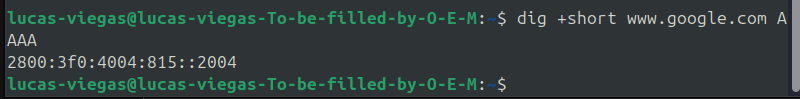{width="6.260416666666667in"
height="0.7708333333333334in"}

-   2800:3f0:4004:815::2004

-   O Google disponibiliza serviços tanto em **IPv4** (registro A)
    quanto em **IPv6** (registro AAAA).

-   Isso significa que, se a rede e o provedor suportarem IPv6, tem como
    se comunicar por esse endereço

3.  Consultar registros NS:

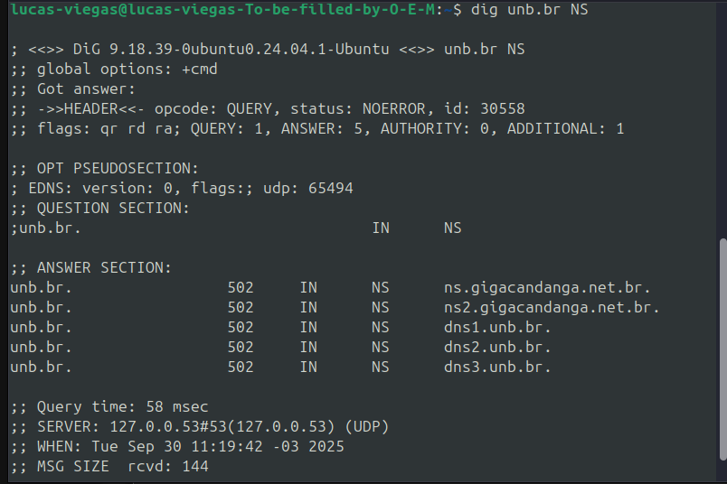{width="6.260416666666667in"
height="4.177083333333333in"}

-   Na seção ANSWER SECTION, apareceram 5 servidores de nomes
    autoritativos para o domínio unb.br.

-   Esses são os **DNS autoritativos** responsáveis pelo domínio da
    **Universidade de Brasília (UnB)**.

-   Eles contêm os registros oficiais (A, AAAA, MX, etc.) para tudo que
    pertence ao domínio unb.br.

4.  Consultar CNAME:

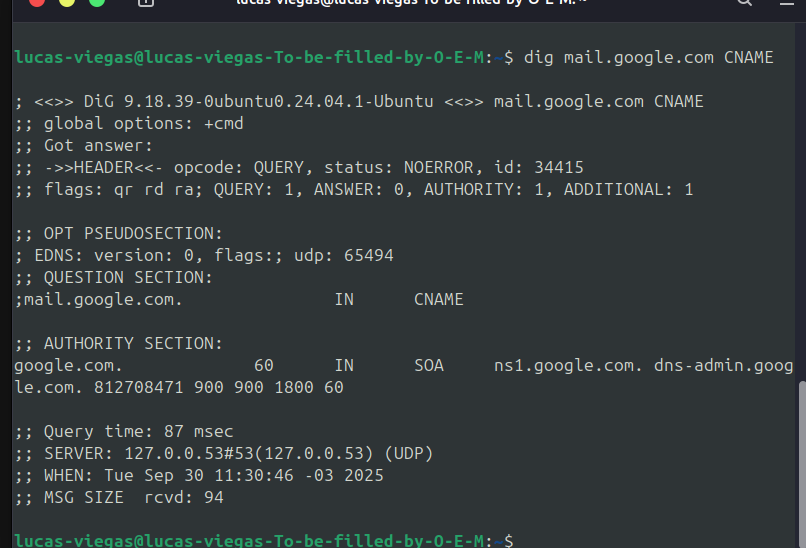{width="6.260416666666667in"
height="4.260416666666667in"}

-   No caso de mail.google.com, o Google não usa CNAME para esse host.

-   Geralmente, serviços como Gmail usam diretamente registros **A** ou
    **AAAA** que apontam para IPs.

5.  Consultar usando servidor público (Google DNS)

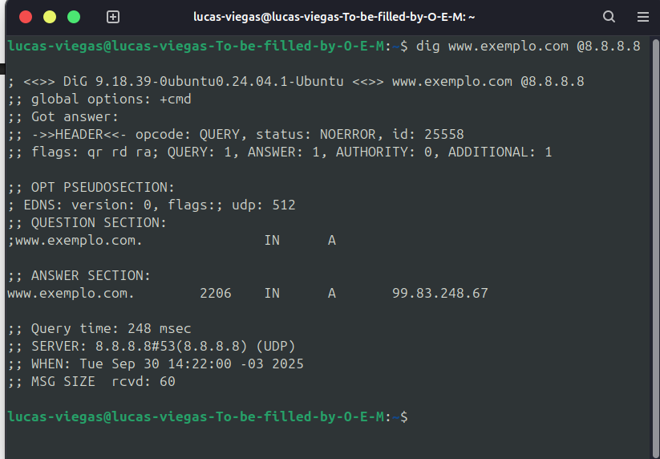{width="6.260416666666667in"
height="4.354166666666667in"}

-   No comando dig www.exemplo.com \@8.8.8.8, o servidor DNS do Google
    retornou um registro **A** com o IP **99.83.248.67** e TTL de 2206
    segundos.

## Parte 3 -- Hierarquia e iteração

1.  Seguir a cadeia de resolução:

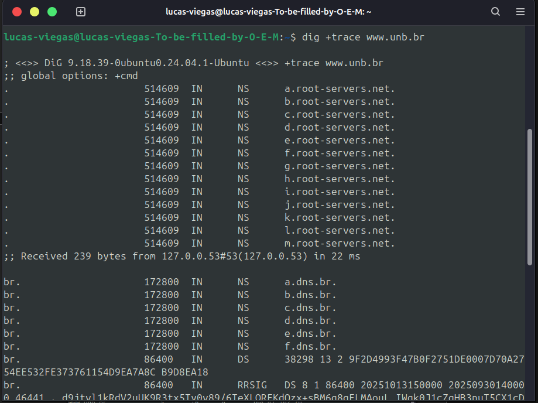{width="6.260416666666667in"
height="4.6875in"}

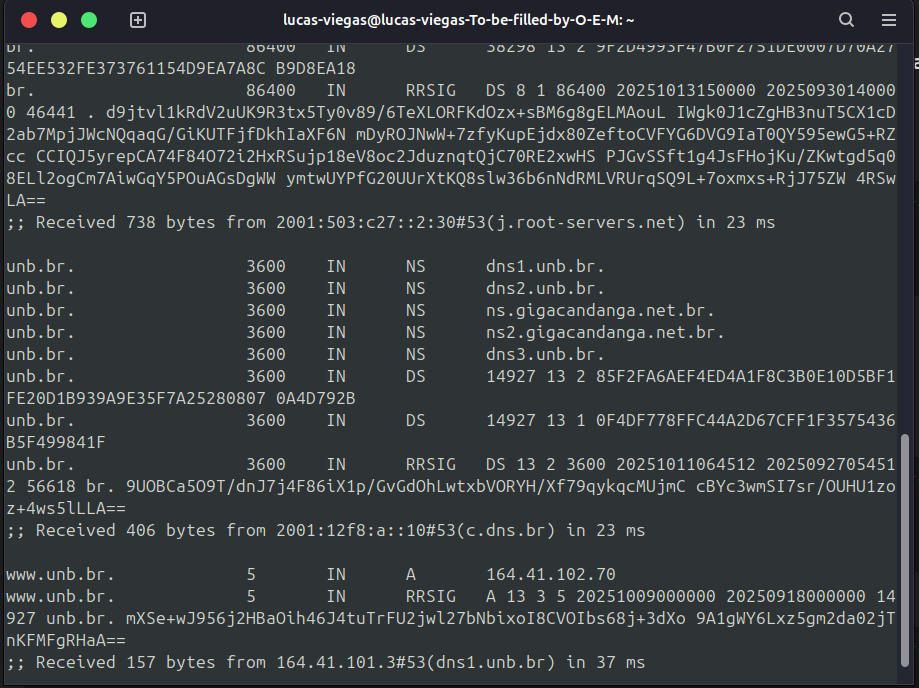{width="6.260416666666667in"
height="4.6875in"}

-   O +trace mostra todo o caminho da resolução DNS:

-   começa nos **servidores raiz** →

-   passa pelos **servidores do TLD .br** →

-   chega nos **servidores da UNB** →

-   e termina entregando o IP de [www.unb.br](https://www.unb.br).

## Parte 4 -- Ferramentas alternativas

1.  Resolução simples

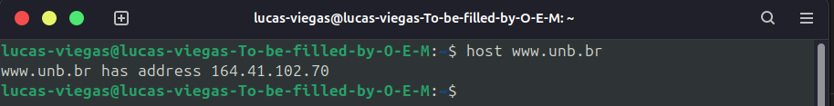{width="6.260416666666667in"
height="0.8020833333333334in"}

-   O comando **host** é uma alternativa mais simples ao dig, pois ele
    so faz a resolução direta do domínio, dessa forma retornando o
    endereço IPV4 que é 164.41.102.70 alem disso o host retorna apenas a
    informação essencial.

2.  Consultar MX:

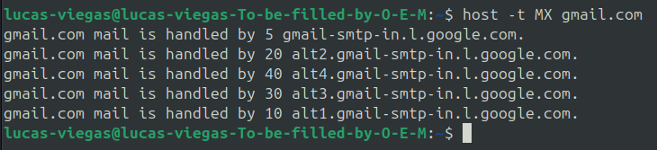{width="6.260416666666667in"
height="1.4270833333333333in"}

-   o **Gmail tem vários servidores redundantes** para receber
    mensagens, garantindo disponibilidade e balanceamento de carga.

3.  Reverse lookup (PTR):

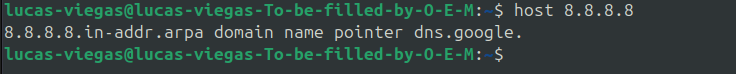{width="6.260416666666667in"
height="0.625in"}

-   O comando host 8.8.8.8 realiza uma **consulta reversa de DNS**, ou
    seja, encontra o nome de domínio associado a um endereço IP.

-   No caso, o IP **8.8.8.8** retorna o domínio **dns.google**,
    confirmando que pertence ao serviço de DNS público do Google.

## Parte 5 -- DNSSEC e TCP

1.  Verificar DNSSEC:

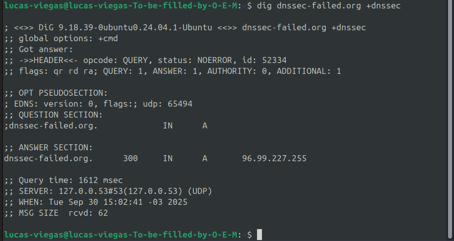{width="6.260416666666667in"
height="3.3229166666666665in"}

-   o comando mostra que o domínio responde, mas a proteção do DNSSEC
    **falha**, servindo de teste para verificar validadores.

-   O dig consultou o domínio **dnssec-failed.org** pedindo informações
    de **DNSSEC**.

-   A resposta trouxe um **registro A**: 96.99.227.255.

-   Isso significa que, embora o IP seja retornado, a assinatura digital
    do DNSSEC **não é válida**.

-   Em um servidor que **valida DNSSEC**, essa consulta seria rejeitada
    (marcada como insegura).

2.  Forçar TCP em vez de UDP:

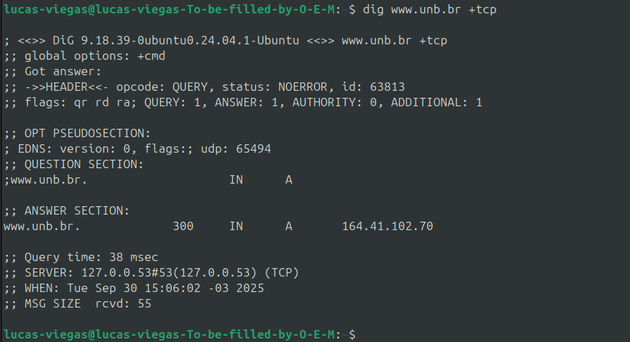{width="6.260416666666667in"
height="3.40625in"}

-   O dig consultou o domínio [**www.unb.br**](https://www.unb.br)
    pedindo o **registro A** (IPv4).

-   O parâmetro +tcp força a consulta a ser feita usando **TCP** em vez
    do padrão **UDP**.

-   O servidor respondeu com o IP **164.41.102.70**, confirmando que a
    resolução funciona também via TCP.

-   A linha SERVER: 127.0.0.53#53 (TCP) mostra que foi usado o
    **loopback local** (o resolvedor que o seu sistema está usando) e
    que o transporte foi TCP.

-   Dessa forma podemos concluir que o servidor aceita consultas via TCP
    o que é importante porque nem todas as consultas DNS podem ser
    feitas apenas com UDP por serem grandes ou ele está bloqueado

## Parte 6 - Questões reflexivas

1.  Como o TTL afeta o tempo de propagação de mudanças?

-   O **TTL (Time To Live)** é o tempo (em segundos) que um registro DNS
    pode ficar armazenado em **cache** nos resolvedores e clientes,
    dessa forma enquanto TTL não expira, os resolvers continuam usando a
    informação anterior no cache, sem consultar o servidor de origem de
    novo.

-   Quando uma mudança é feita no DNS (por exemplo, trocar o IP de um
    site), os usuários só verão essa mudança **depois que o TTL
    expirar** e o cache for atualizado.

2.  Qual a diferença entre consulta recursiva e iterativa?

-   **Consulta recursiva**: o resolvedor DNS (ex.: 8.8.8.8 do Google)
    **faz todo o trabalho pelo cliente**.

> O cliente pergunta uma vez e o resolvedor vai atrás da resposta,
> consultando outros servidores se necessário, até devolver o resultado.
>
> Exemplo: quando seu computador consulta o DNS configurado no sistema.

-   **Consulta iterativa**: o servidor consultado **não faz todo o
    trabalho**, apenas aponta para outro servidor que pode ter a
    resposta.

> O cliente (ou resolvedor) precisa repetir a consulta passo a passo até
> chegar ao servidor autoritativo.
>
> Exemplo: perguntar primeiro ao root server, depois ao servidor do .br,
> depois ao servidor da unb.br, etc.

3.  . Por que resolvedores públicos podem ser mais rápidos?

-   Eles são mais rápidos porque têm infraestrutura global, caches
    maiores e rotas de rede mais eficientes que os servidores locais dos
    provedores.

4.  Para que serve o reverse lookup (PTR)?

-   O reverse lookup é o processo de resolver um **endereço IP → nome de
    domínio**.

-   Ele utiliza registros **PTR** armazenados no DNS reverso
    (in-addr.arpa para IPv4, ip6.arpa para IPv6).

-   O principal uso dele é para identificação de servidores de
    email(filtro anti-spam) verificando se o IP do remetente corresponde
    ao domínio.

-   Diagnóstico de rede: identificar máquinas por nome em vez de IP.

-   Segurança: confirmar a identidade de servidores.
