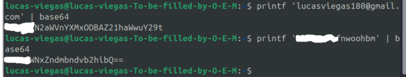
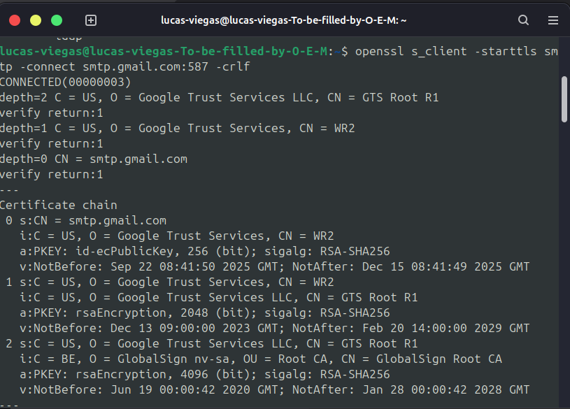
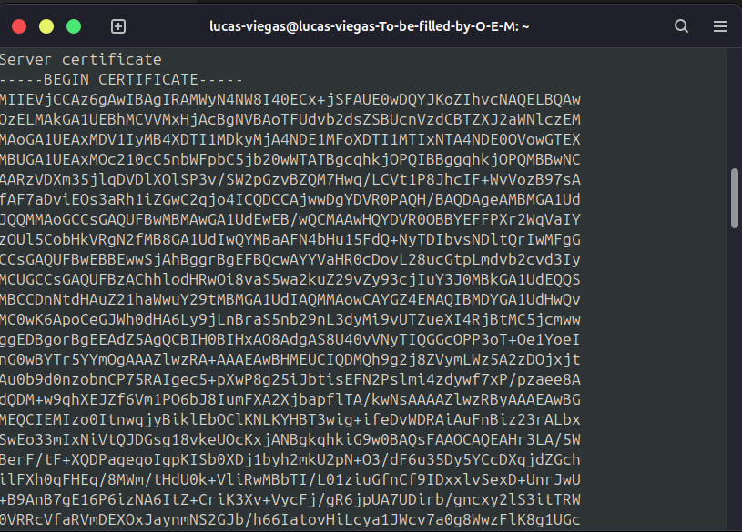
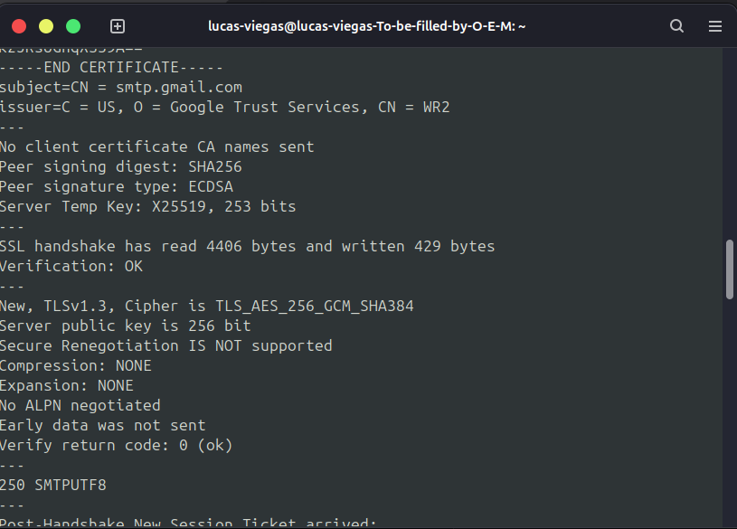
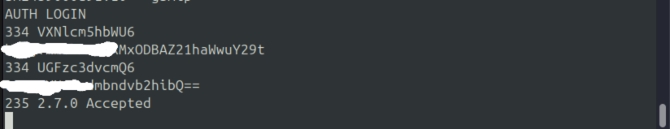
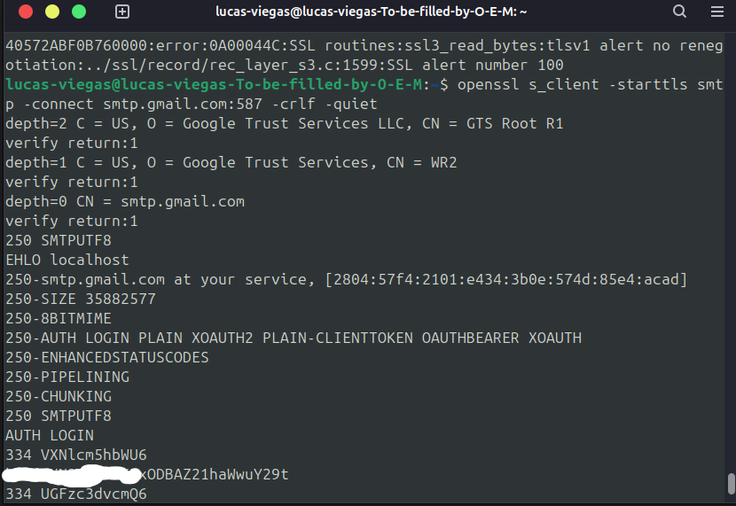
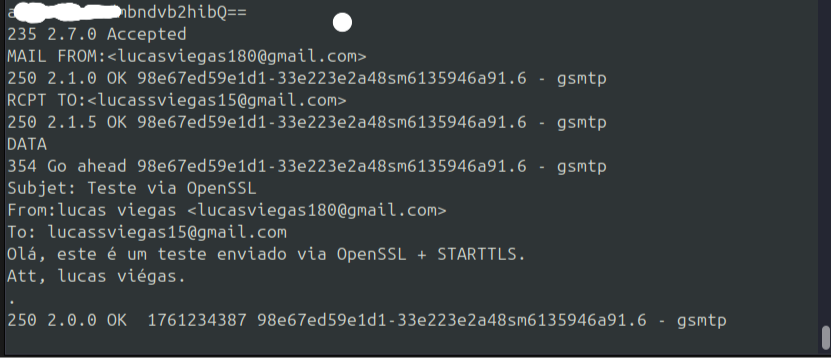
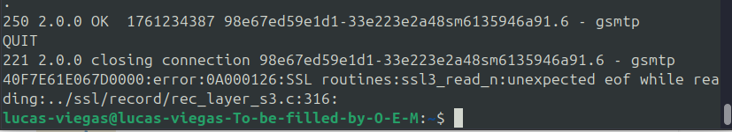
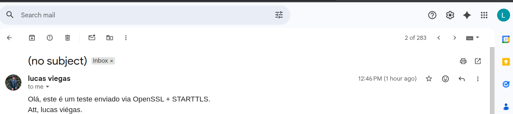

**Materia**: Fundamentos de redes -- ENE0274

**Professor:** Laerte Peotta de Melo, Dr.

**Aluno**: lucas de souza viegas

1)  Codifique as credenciais com Base64

{width="6.260416666666667in"
height="1.1875in"}

2)  Conexão com o smtp do google

{width="6.260416666666667in"
height="4.489583333333333in"}

{width="6.260416666666667in"
height="4.489583333333333in"}

{width="6.260416666666667in"
height="4.489583333333333in"}

-   **openssl s_client**: cria uma conexão segura usando TLS/SSL.

-   **-starttls smtp**: inicia a negociação TLS sobre o protocolo SMTP.

-   **-connect smtp.gmail.com:587**: conecta à porta SMTP do Gmail
    (587).

-   O terminal mostra o **certificado digital** do servidor, confirmando
    que a comunicação é autenticada e segura.

3)  Handshake com SMTP + AUTH LOGIN

{width="6.260416666666667in"
height="1.1979166666666667in"}

4)  Envio da mensagem

{width="6.260416666666667in"
height="4.302083333333333in"}

{width="6.260416666666667in"
height="2.71875in"}

{width="6.260416666666667in"
height="1.1354166666666667in"}

> {width="6.260416666666667in"
> height="1.40625in"}

5)  Eu me conectei de forma correta ao **SMTP do Gmail** com
    **STARTTLS** (conexão segura).

-   As credenciais foram autenticadas.

-   O e-mail foi enviado e confirmado pelo servidor (250 2.0.0 OK).

-   O encerramento da conexão foi normal.
