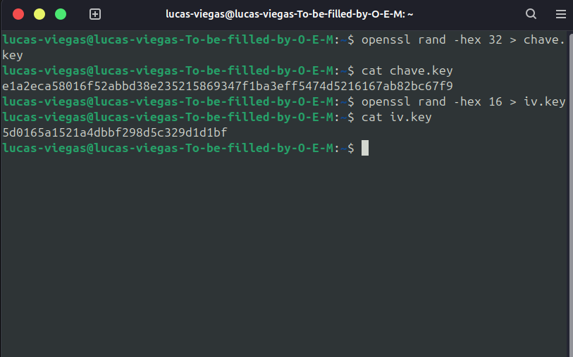
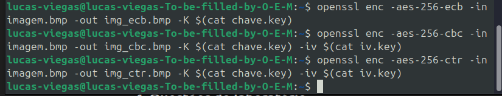
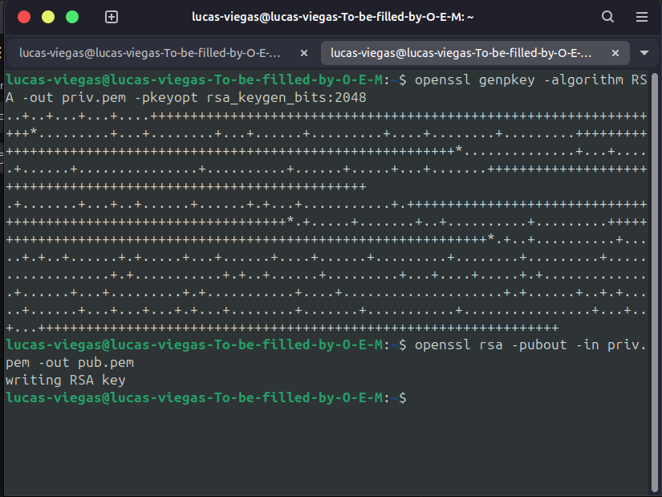
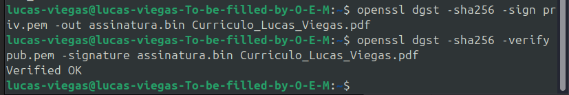
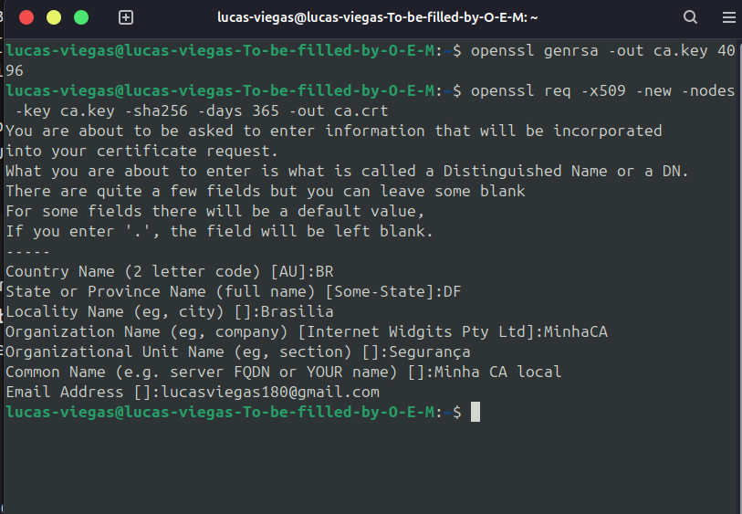
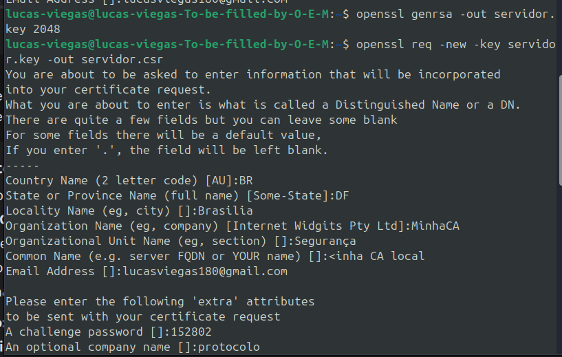
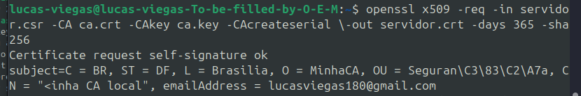
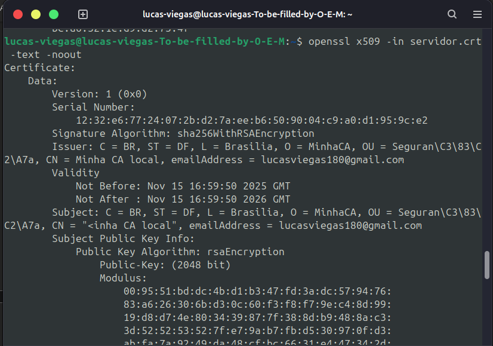
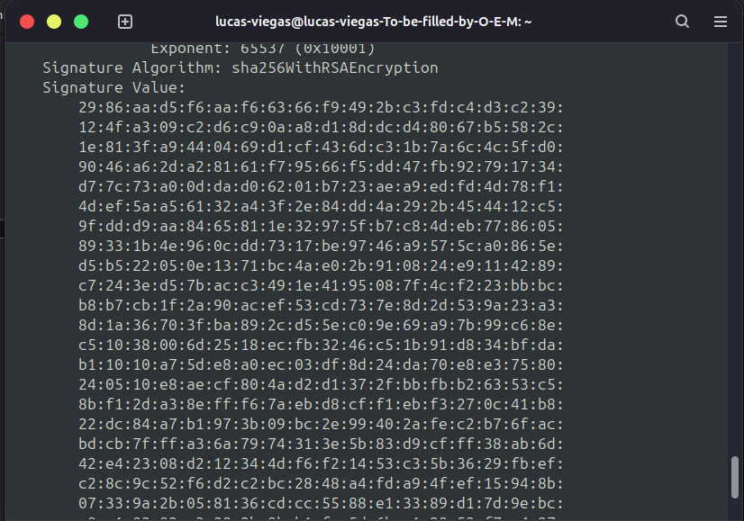

**Materia**: Fundamentos de redes -- ENE0274

**Professor:** Laerte Peotta de Melo, Dr.

**Aluno**: lucas de souza viegas


1.  Criptografia Simétrica e Modos de Operação O AES é amplamente
    utilizado em VPNs, TLS e Wi-Fi. a)

```{=html}
<!-- -->
```
A.  Explique por que o modo ECB não deve ser utilizado em aplicações que
    envolvem padrões visuais ou dados estruturados.

-   ECB **não oferece confidencialidade adequada** para dados com
    padrões visuais ou estruturais.

-   

B.  Compare os modos CBC e CTR quanto à paralelização, desempenho e
    vulnerabilidade a ataques.

-   O modo **CBC** não permite paralelização na cifragem (cada bloco
    depende do anterior), sendo mais lento. Já o **CTR** permite
    paralelização total, oferecendo melhor desempenho.\
    Em termos de segurança, o CBC é vulnerável a ataques de **bit
    flipping** se o IV for previsível, enquanto o CTR pode ser
    comprometido se o **nonce/contador for reutilizado**.

C.  Dê um exemplo de aplicação real em que o modo CTR seria mais
    indicado que o CBC e justifique.

-   Transmissão de dados em redes de alta velocidade, como VPNs ou Wi-Fi
    (WPA2/AES-CTR).

-   Pois o modo CTR permite processamento paralelo e baixa latência,
    ideal para fluxos contínuos de dados.\
    Além disso, ele transforma o bloco cifrador em um gerador de fluxo
    de chave (stream cipher), o que facilita a transmissão em tempo real
    sem precisar esperar pelo bloco anterior --- algo essencial em
    comunicações seguras e streaming.

2.  Criptografia Assimétrica e Troca de Chaves

```{=html}
<!-- -->
```
a.  Descreva como o protocolo TLS utiliza criptografia assimétrica
    apenas na etapa inicial da comunicação.

-   O TLS usa criptografia assimétrica apenas no início para autenticar
    o servidor (e às vezes o cliente) e trocar a chave simétrica de
    sessão com segurança. Depois disso, a comunicação usa criptografia
    simétrica (ex: AES), que é mais rápida.

b.  Compare RSA, Diffie-Hellman e ECC em relação à segurança, desempenho
    e tamanho das chaves.

-   RSA: Alta segurança, mas chaves grandes e desempenho mais lento.

-   Diffie-Hellman (DH): Permite troca segura de chaves, porém também
    usa chaves grandes e é mais lento.

-   ECC (Elliptic Curve Cryptography): Oferece a mesma segurança com
    chaves menores e melhor desempenho.

c.  Explique o impacto que o algoritmo de Shor teria sobre cada um
    desses sistema

-   O algoritmo de Shor (quântico) pode quebrar RSA, Diffie-Hellman e
    ECC, pois consegue fatorar números grandes e resolver logaritmos
    discretos rapidamente, tornando esses sistemas inseguros frente à
    computação quântica.

3.  Funções de Hash e Assinaturas Digitais

```{=html}
<!-- -->
```
a.  Explique o papel da função hash na assinatura digital.

-   A função **hash** gera um **resumo único** do conteúdo que será
    assinado digitalmente. Assim, a assinatura é feita sobre o **hash**,
    não sobre o arquivo inteiro, garantindo **integridade** e
    **eficiência**.

b.  Por que o uso de MD5 e SHA-1 é considerado inseguro atualmente?

-   **MD5** e **SHA-1** são considerados inseguros porque **colisões**
    já foram encontradas --- ou seja, diferentes mensagens podem gerar o
    **mesmo hash**, comprometendo a autenticidade dos dados.

c.  Uma pequena alteração em um arquivo altera completamente o hash
    SHA-256. Nomeie e descreva a propriedade que explica esse
    comportamento.

-   Essa propriedade é chamada de **Efeito Avalanche**: uma **pequena
    alteração** no arquivo causa uma **grande mudança** no hash,
    tornando impossível prever ou relacionar o novo valor ao antigo.

d.  Cite uma aplicação prática onde a verificação de hash é essencia

-   Um exemplo prático é a **verificação de integridade de downloads**
    --- o hash publicado pelo site é comparado com o hash do arquivo
    baixado para garantir que **não foi alterado ou corrompido**.

4.  Infraestrutura de Chaves Públicas (PKI)

```{=html}
<!-- -->
```
a.  Descreva o papel da Autoridade Certificadora (CA) e da cadeia de
    confiança

-   A **Autoridade Certificadora (CA)** emite e valida **certificados
    digitais**, garantindo a autenticidade das chaves públicas.\
    A **cadeia de confiança** é a hierarquia de CAs (raiz →
    intermediárias → usuário) que valida a origem do certificado.

b.  O que acontece quando uma CA raiz é comprometida?

-   Se uma **CA raiz é comprometida**, toda a sua cadeia de certificados
    perde a confiança.\
    Isso permite a criação de **certificados falsos** e compromete a
    **segurança de sites e comunicações** associadas a ela.

c.  Compare CRL e OCSP quanto ao funcionamento e à eficiência.

-   **CRL (Certificate Revocation List):** Lista de certificados
    revogados; precisa ser baixada inteira --- **menos eficiente**.

-   **OCSP (Online Certificate Status Protocol):** Consulta em tempo
    real o status do certificado --- **mais rápido e eficiente**.

d.  Cite um exemplo real de falha ou comprometimento de uma CA e seus
    impactos.

-   Comodo (2011) e DigiNotar (2011) foram comprometidas, resultando na
    emissão de certificados falsos para sites como Google e Yahoo, o que
    permitiu ataques de interceptação (MITM) e levou à revogação e
    falência da DigiNotar.

5.  Criptografia Pós-Quântica

```{=html}
<!-- -->
```
a.  Explique a diferença do impacto da computação quântica em algoritmos
    simétricos e assimétricos.

-   A **computação quântica** afeta fortemente os **algoritmos
    assimétricos** (RSA, ECC, DH) por meio do **algoritmo de Shor**, que
    quebra suas bases matemáticas.\
    Nos **algoritmos simétricos**, o impacto é menor --- o **algoritmo
    de Grover** apenas reduz a segurança efetiva pela metade (ex.:
    AES-256 ≈ AES-128).

b.  Quais algoritmos estão sendo padronizados pelo NIST para resistir a
    ataques quânticos?

-   **Kyber** (criptografia de chave pública/troca de chaves)

-   **Dilithium**, **Falcon** e **SPHINCS+** (assinaturas digitais).

c.  Por que AES-256 e SHA-3 ainda são considerados seguros mesmo diante
    de computadores quânticos?

-   O **AES-256** e o **SHA-3** ainda são seguros porque a computação
    quântica só oferece **vantagem parcial** (reduz força bruta pela
    metade), o que ainda exige **um poder computacional inatingível**
    para quebrá-los

d.  Como uma organização pode começar a se preparar para a transição
    pós-quântica sem interromper serviços existentes?

-   Uma organização pode adotar uma abordagem **híbrida**, combinando
    algoritmos clássicos e pós-quânticos, atualizar sistemas
    gradualmente, testar interoperabilidade e seguir as **recomendações
    do NIST e ETSI** para garantir compatibilidade sem interromper os
    serviços.

## Parte 2 -- Laboratórios

1.  Gere uma chave simétrica de 256 bits e um IV:

{width="6.260416666666667in"
height="3.90625in"}

2.  Cifre um arquivo de imagem (imagem.bmp) usando os modos ECB, CBC e
    CT

{width="6.260416666666667in"
height="1.2083333333333333in"}

3.  

-   Modo ECB:A imagem criptografada continua com a forma visível (o
    "desenho" aparece distorcido, mas reconhecível)

-   ECB NÃO deve ser usado para criptografar imagens, porque mantém
    padrões visíveis.

-   Modo CBC (Cipher Block Chaining):A imagem parece "embaralhada" mais
    uniformemente. CBC **esconde o conteúdo**, mas ainda depende da
    ordem dos blocos.

-   Modo CTR (Counter):A imagem vira puro ruído; totalmente aleatória.
    CTR é **seguro para criptografar imagens**, rápido e permite
    operação paralela.

4.  

-   **O IV é essencial no CBC porque fornece aleatoriedade inicial e
    impede que o primeiro bloco seja sempre igual quando a mesma
    mensagem é cifrada.**

-   **O IV é essencial no CTR porque garante um keystream único e evita
    reutilização, que quebraria a segurança do modo.**

-   **O processamento totalmente paralelo ocorre no modo CTR, pois os
    blocos não dependem uns dos outros.**

5.  **Modo CTR --- TOTALMENTE paralelo**

-   cada bloco usa **AES(IV + contador)**

-   não depende do bloco anterior

-   não há encadeamento

-   **todos os blocos podem ser criptografados em paralelo**.

## Parte 2.1 -- Laboratórios

1.  Gere um par de chaves RSA de 2048 bits:

{width="6.260416666666667in"
height="4.697916666666667in"}

2.  Gere o hash de um arquivo (relatorio.pdf) e assine digitalmente:

3.  Verifique a assinatura com a chave pública

{width="6.260416666666667in"
height="1.0416666666666667in"}

4.  

```{=html}
<!-- -->
```
1.  A assinatura **falha na verificação**.\
    Mesmo uma alteração mínima muda o **hash**, e a chave pública não
    consegue validar a assinatura → resultado: **Verification Failure**.

2.  H=SHA-256(arquivo)\]

-   S=H\^d mod n -\> assinatura digital

3.  Verificação:

-   O verificador recalcula o hash: H'=SHA-256(arquivo)

-   Usa a **chave pública** para decifrar a assinatura:H=S\^e mod n

-   Compara:Se **H = H\' → assinatura válida**

-   Se **diferente → arquivo alterado**

4.  Como a PKI garante que a chave pública pertence de fato ao autor?

-   Porque a chave pública vem dentro de um **certificado digital**, que
    é assinado por uma **Autoridade Certificadora (AC)** confiável.

1.  A AC garante:

-   A chave pública realmente pertence à pessoa/entidade.

-   O certificado não foi falsificado.

-   Ele não foi revogado.

## Parte 2 .2 -- Laboratórios

Laboratório 3 -- Mini PKI e Certificados Digitais

1.  Crie uma Autoridade Certificadora (CA):

{width="6.260416666666667in"
height="4.333333333333333in"}

2.  Gere uma chave e um CSR (pedido de assinatura) para um servidor:

{width="6.260416666666667in"
height="3.9791666666666665in"}

3.  openssl x509 -req -in servidor.csr -CA ca.crt -CAkey ca.key
    -CAcreateserial \\-out servidor.crt -days 365 --sha256

{width="6.260416666666667in"
height="1.0416666666666667in"}

4.  openssl x509 -in servidor.crt -text --noout

{width="6.260416666666667in"
height="4.385416666666667in"}

{width="6.260416666666667in"
height="4.385416666666667in"}

I.  Subject

-   Identidade do dono do certificado (ex: domínio do servidor)

II. Issuer

-   Quem assinou o certificado (a CA).

III. Subject Public Key Info

-   Chave pública e algoritmo usado

IV. Serial Number

-   Número único do certificado emitido pela CA.

V.  Validity

-   Período de "notBefore" e "notAfter"

VI. Signature Algorithm

-   Algoritmo usado na assinatura (ex.: sha256WithRSAEncryption).

1.  Como a cadeia de confiança é verificada em uma conexão HTTPS real?

-   Quando se acessa <https://site.com>:

-   O servidor envia seu **certificado** para o navegador.

-   O navegador verifica:

    -   Se o certificado foi assinado por uma CA confiável.

    -   Se a assinatura é válida.

    -   Se o certificado não expirou.

    -   Se o domínio do certificado bate com a URL.

-   O navegador compara a CA do certificado com as **CAs raiz
    instaladas** no sistema.

-   Se a CA é confiável → o navegador aceita a conexão.

-   A confiança vem das CAs raiz pré-instaladas no navegador/sistema
    operacional.

2.  O que aconteceria se a CA fosse comprometida

Se a chave privada da CA vazar:

-   Atacantes podem criar certificados legítimos para qualquer site.

-   Poderiam imitar bancos, correios, lojas, governos.

-   Permite ataques MITM totalmente invisíveis para o usuário.

-   Navegadores teriam que revogar essa CA rapidamente (via CRL/OCSP ou
    atualização do browser).

```{=html}
<!-- -->
```
-   Seria uma falha crítica na segurança global (como já ocorreu com
    DigiNotar e Comodo).
